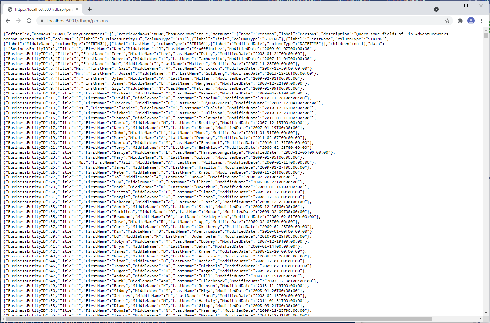
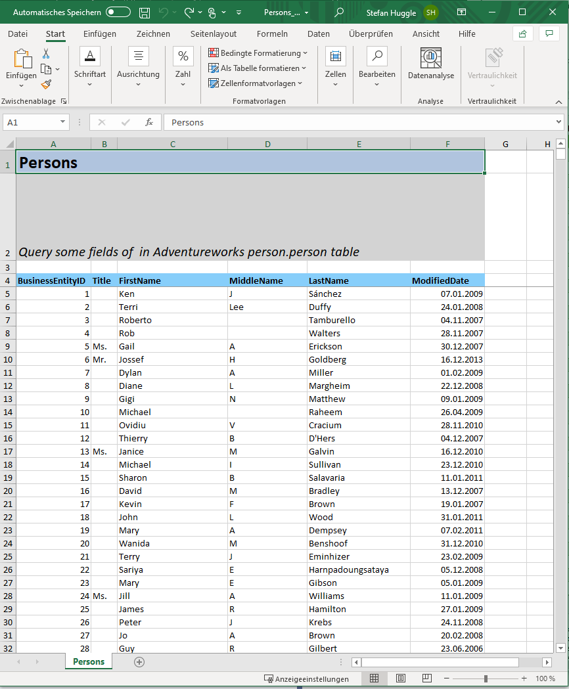

# RestlessDb
Create REST endpoints based on database queries within minutes with an ASP.net core based backend. Creating a new REST endpoint just requires one insert in a *QueryItem* table.
Multiple output formats like json, csv, excel and xml are provided.
Currently only SQL server as backend is supported, extension for other databases is planned

## Prerequisites
- .net Core Framework 3.1 or higher
- Sql Server DB instance
- Adventureworks DB for the examples

## Example Usage
The given exammples are based on the example database *Adventureworks* provided by Microsoft(R) which can be downloaded from here:
 [Adventureworks Example Db download](https://docs.microsoft.com/en-us/sql/samples/adventureworks-install-configure?view=sql-server-ver15&tabs=ssms).
 All examples can be easily transformed to a different database schema.
 
- clone this repository:
 
``` powershell
git clone https://github.com/stefanhug/GenericDbRestApi.git
```
- configure the DB connection
Edit the connection string in *GenericDbRestApi/GenericDbRestApi/appsettings.Development.json* to match your database, user and password:
``` js
{
  "Logging": {
    "LogLevel": {
      "Default": "Information",
      "Microsoft": "Warning",
      "Microsoft.Hosting.Lifetime": "Information"
    }
  },
  "AppSettings": {
    "ConnectionString": "Data Source={MYDATABASE};Initial Catalog=Adventureworks2019;User Id={MYUSER};Password={MYPASSWORD};MultipleActiveResultSets=True"
  }
}
```

- build the repository:
``` pwsh
cd ./GenericDbRestApi/
dotnet restore
dotnet build
```
- run the SQL script *DbScripts/createqueryrepository.sql* with *sqlcmd* or *SQL server management studio* in your DB to create the query repository table *GQuery.QueryItem* 
- add exanple queries by running  *DbScripts/exampledb/FillQueryRepository4AdventureWorks.sql*. If another DB schema than adventureworks is used the examples need to be adapted.
- start the application:
``` pwsh
cd ./bin/netcoreapp3.1/
GenericDbRestApi.exe --environment=Development
```
- open a browser a enter the URL *https://localhost:5001/dbapi/persons*
  You should see the following output of the *Adventureworks Person* table:
  

Let's compare this to the corresponding QueryItem inserted in *FillQueryRepository4AdventureWorks.sql*:
``` sql
insert into GQuery.QueryItem(Name, Label, Description, Sql)
values('Persons', 'Persons', 
       'Query some fields of  in Adventureworks person.person table', 
       'select BusinessEntityID, Title, FirstName, MiddleName, LastName, ModifiedDate 
	from Person.Person 
	order by BusinessEntityID')
```

The SQL statement to execute is specified in the *QueryItem.Sql* column, *QueryItem.Name* is used to specifiy the endpoint url of the query:

```
https://{{SERVER}:{PORT}/dbapi/{QueryItem.Name}
```

**Note: the SQL statement needs to contain an order by clause to make range selection working. But this is anyway reequired to ensure that the results of a DB query are predictable** 


## Specify ranges for output and max rows to return
The following parameters can be used to specify maximum number of rows to return and the offsett from the begin of the query.
Per default only the first 8000 rows delivered by a query will be returned.

- maxrows (default: 8000)
- offset (default: 0)

Example:
```
https://localhost:44352/dbapi/persons?maxrows=10
https://localhost:44352/dbapi/persons?maxrows=10&offset=8000
```

## Supported output formats
GenericDbRestApi supports currently the following output formats via the URL query parameter *outputformat*:
- json - default if no format specified
- comma separated value (csv)
- excel
- xml (via. XML datacontract serializer)

```
https://localhost:44352/dbapi/persons?maxrows=1000&outputformat=json
https://localhost:44352/dbapi/persons?maxrows=1000&outputformat=excel
https://localhost:44352/dbapi/persons?maxrows=1000&outputformat=csv
https://localhost:44352/dbapi/persons?maxrows=1000&outputformat=xml
```


Usage uf the http *accept* header is (currently) not supported.

### JSON
- Information of the retrieve columns is provided in metaData.Columns
- hasMoreRows: more rows from the query available after the specified range (default: 0..8000)
- data of the query is provided in *data* field as array of json objects

```javascript
{
	"offset": 0,
	"maxRows": 3,
	"queryParameters": {},
	"retrievedRows": 3,
	"hasMoreRows": true,
	"metaData": {
		"name": "Persons",
		"label": "Persons",
		"description": "Query some fields of  in Adventureworks person.person table",
		"columns": [
			{
				"label": "BusinessEntityID",
				"columnType": "INT"
			},
			{
				"label": "Title",
				"columnType": "STRING"
			},
			{
				"label": "FirstName",
				"columnType": "STRING"
			},
			{
				"label": "MiddleName",
				"columnType": "STRING"
			},
			{
				"label": "LastName",
				"columnType": "STRING"
			},
			{
				"label": "ModifiedDate",
				"columnType": "DATETIME"
			}
		],
		"children": null
	},
	"data": [
		{
			"BusinessEntityID": 1,
			"Title": "",
			"FirstName": "Ken",
			"MiddleName": "J",
			"LastName": "Sánchez",
			"ModifiedDate": "2009-01-07T00:00:00"
		},
		{
			"BusinessEntityID": 2,
			"Title": "",
			"FirstName": "Terri",
			"MiddleName": "Lee",
			"LastName": "Duffy",
			"ModifiedDate": "2008-01-24T00:00:00"
		}
	]
}
```

### CSV
First Line is header, second header columns

```csv
Persons - Query some fields of  in Adventureworks person.person table
BusinessEntityID,Title,FirstName,MiddleName,LastName,ModifiedDate
1,,Ken,J,Sánchez,07.01.2009 00:00:00
2,,Terri,Lee,Duffy,24.01.2008 00:00:00
3,,Roberto,,Tamburello,04.11.2007 00:00:00
```

### Excel
The library *ClosedXML* ( [Closed XML Github page](https://github.com/ClosedXML/ClosedXML "Closed XML Github page") )is used for transforming the retrieved data to excel. 
The label (*QueryItem.Label*), Description (*QueryItem.Description*) and column header rows are fixed.



### XML
```xml
<QueryResult xmlns="http://schemas.datacontract.org/2004/07/GenericDbRestApi.Lib.Types"
           	xmlns:i="http://www.w3.org/2001/XMLSchema-instance">
	<Data xmlns:a="http://schemas.microsoft.com/2003/10/Serialization/Arrays">
		<a:ArrayOfKeyValueOfstringanyType>
			<a:KeyValueOfstringanyType>
				<a:Key>BusinessEntityID</a:Key>
				<a:Value i:type="b:int"
       					xmlns:b="http://www.w3.org/2001/XMLSchema">1</a:Value>
			</a:KeyValueOfstringanyType>
			<a:KeyValueOfstringanyType>
				<a:Key>Title</a:Key>
				<a:Value i:type="b:string"
       					xmlns:b="http://www.w3.org/2001/XMLSchema"/>
			</a:KeyValueOfstringanyType>
			<a:KeyValueOfstringanyType>
				<a:Key>FirstName</a:Key>
				<a:Value i:type="b:string"
       					xmlns:b="http://www.w3.org/2001/XMLSchema">Ken</a:Value>
			</a:KeyValueOfstringanyType>
			<a:KeyValueOfstringanyType>
				<a:Key>MiddleName</a:Key>
				<a:Value i:type="b:string"
       					xmlns:b="http://www.w3.org/2001/XMLSchema">J</a:Value>
			</a:KeyValueOfstringanyType>
			<a:KeyValueOfstringanyType>
				<a:Key>LastName</a:Key>
				<a:Value i:type="b:string"
       					xmlns:b="http://www.w3.org/2001/XMLSchema">Sánchez</a:Value>
			</a:KeyValueOfstringanyType>
			<a:KeyValueOfstringanyType>
				<a:Key>ModifiedDate</a:Key>
				<a:Value i:type="b:dateTime"
       					xmlns:b="http://www.w3.org/2001/XMLSchema">2009-01-07T00:00:00</a:Value>
			</a:KeyValueOfstringanyType>
		</a:ArrayOfKeyValueOfstringanyType>
		<a:ArrayOfKeyValueOfstringanyType>
			<a:KeyValueOfstringanyType>
				<a:Key>BusinessEntityID</a:Key>
				<a:Value i:type="b:int"
       					xmlns:b="http://www.w3.org/2001/XMLSchema">2</a:Value>
			</a:KeyValueOfstringanyType>
			<a:KeyValueOfstringanyType>
				<a:Key>Title</a:Key>
				<a:Value i:type="b:string"
       					xmlns:b="http://www.w3.org/2001/XMLSchema"/>
			</a:KeyValueOfstringanyType>
			<a:KeyValueOfstringanyType>
				<a:Key>FirstName</a:Key>
				<a:Value i:type="b:string"
       					xmlns:b="http://www.w3.org/2001/XMLSchema">Terri</a:Value>
			</a:KeyValueOfstringanyType>
			<a:KeyValueOfstringanyType>
				<a:Key>MiddleName</a:Key>
				<a:Value i:type="b:string"
       					xmlns:b="http://www.w3.org/2001/XMLSchema">Lee</a:Value>
			</a:KeyValueOfstringanyType>
			<a:KeyValueOfstringanyType>
				<a:Key>LastName</a:Key>
				<a:Value i:type="b:string"
       					xmlns:b="http://www.w3.org/2001/XMLSchema">Duffy</a:Value>
			</a:KeyValueOfstringanyType>
			<a:KeyValueOfstringanyType>
				<a:Key>ModifiedDate</a:Key>
				<a:Value i:type="b:dateTime"
       					xmlns:b="http://www.w3.org/2001/XMLSchema">2008-01-24T00:00:00</a:Value>
			</a:KeyValueOfstringanyType>
		</a:ArrayOfKeyValueOfstringanyType>a
	</Data>
	<HasMoreRows>true</HasMoreRows>
	<MaxRows>3</MaxRows>
	<MetaData>
		<Children i:nil="true"/>
		<Columns>
			<QueryColumn>
				<ColumnType>INT</ColumnType>
				<Label>BusinessEntityID</Label>
			</QueryColumn>
			<QueryColumn>
				<ColumnType>STRING</ColumnType>
				<Label>Title</Label>
			</QueryColumn>
			<QueryColumn>
				<ColumnType>STRING</ColumnType>
				<Label>FirstName</Label>
			</QueryColumn>
			<QueryColumn>
				<ColumnType>STRING</ColumnType>
				<Label>MiddleName</Label>
			</QueryColumn>
			<QueryColumn>
				<ColumnType>STRING</ColumnType>
				<Label>LastName</Label>
			</QueryColumn>
			<QueryColumn>
				<ColumnType>DATETIME</ColumnType>
				<Label>ModifiedDate</Label>
			</QueryColumn>
		</Columns>
		<Description>Query some fields of  in Adventureworks person.person table</Description>
		<Label>Persons</Label>
		<Name>Persons</Name>
	</MetaData>
	<Offset>0</Offset>
	<QueryParameters xmlns:a="http://schemas.microsoft.com/2003/10/Serialization/Arrays"/>
	<etrievedRows>3</RetrievedRows>
</QueryResult>
```


## REST query parameters
The SQL statements in the *QueryItem* table can contain parameters which need to be provided als query string parameters to the rest endpoint:

```sql
insert into GQuery.QueryItem(Name, Label, Description, Sql)
values('PersonsByLastName', 'Persons filtered by last name', 
       'Parametrized Query of  in Adventureworks person.person table - with parameter lastName', 
       'select BusinessEntityID, Title, FirstName, MiddleName, LastName, ModifiedDate 
        from Person.Person
        where LastName = @LASTNAME
        order by FirstName')
```

In the corresponding REST call the query parameter(s) are specified whithout the *@* sign.
```
https://localhost:5001/dbapi/personsbylastname?lastname=Smith
https://localhost:5001/dbapi/personsbylastname?lastname=Smith&outputformat=excel
```


## Hierarchical queries
Hierarchical queries are supported, for each node in the hierarchical query a *QueryItem* needs to be createdcolumns .
Child nodes reference their parent node via *QueryItem.Parent* column. (*QueryItem.Parent* is NULL for top level nodes and simple queries)
Child queries can contain parameters referring to columns of the parent row, like *@SalesOrderID* in the example below.

```
https://localhost:5001/dbapi/salesorders?maxrows=2
```

```sql
insert into GQuery.QueryItem(Name, Label, Description, Sql)
values('SalesOrders', 'Sales Orders', 
       'Query of some fields from the the Adventureworks table Sales.SalesOrderHeader',
       'select SalesOrderID, OrderDate, CustomerID, SubTotal from Sales.SalesOrderHeader order by SalesOrderID')

insert into GQuery.QueryItem(Name, Label, Description, Parent, Pos, Sql)
values('SalesOrderDetails', 'Sales Order Details', 
       'Query of some fields from the the Adventureworks table Sales.SalesOrderDetail as detail query',
       'SalesOrders', 0,
       'select SalesOrderDetailID, ProductID, OrderQty, UnitPrice, LineTotal from sales.SalesOrderDetail where SalesOrderID = @SalesOrderID order by SalesOrderDetailID')
```

In the *json* output format the metata field for a hierarchical query has a tree like structure, the child objects are stored as list of objects in the data list for each object

```javascript
{
	...
	"metaData": {
		"name": "SalesOrders",
		"label": "Sales Orders",
		"description": "Query of some fields from the the Adventureworks table Sales.SalesOrderHeader",
		"columns": [
			{
				"label": "SalesOrderID",
				"columnType": "INT"
			},
			...
		],
		"children": [
			{
				"name": "SalesOrderDetails",
				"label": "Sales Order Details",
				"description": "Query of some fields from the the Adventureworks table Sales.SalesOrderDetail as detail query",
				"columns": [
					{
						"label": "SalesOrderDetailID",
						"columnType": "INT"
					},
					...
				],
				"children": null
			}
		]
	},
	"data": [
		{
			"SalesOrderID": 43659,
			"OrderDate": "2011-05-31T00:00:00",
			"CustomerID": 29825,
			"SubTotal": 20565.6206,
			"SalesOrderDetails": [
				{
					"SalesOrderDetailID": 1,
					"ProductID": 776,
					"OrderQty": 1,
					"UnitPrice": 2024.994,
					"LineTotal": 2024.994
				},
				...
			]
		},
		...
	]
}
```

For the output formats excel and csv additional columns for the child columns are created and new rows for each child are added:

- Excel: <a id="raw-url" href="./doc/SalesOrders_Hierarchical.xlsx">Excel hierarchical query</a>
- CSV: <a id="raw-url1" href="./doc/SalesOrders_Hierarchical.csv">CSV hierarchical query</a>

## Integrating *GenericDbRestApi.Lib.dll* in an existing application
The proided example application GenericDbRestApi is a minimum example appserver without authentication and other features.
To integrate GenericDbRestApi in an existing project the following step is necessary (nuget package is not yet available).
- reference *GenericDbRestApi.Lib.dll* in your project
- Add the following code to you *Startup.cs*

``` csharp
...
using GenericDbRestApi.Lib.Services;  //ADD
...
namespace GenericDbRestApi
{
    public class Startup
    {
	...
	
	public void ConfigureServices(IServiceCollection services)
        {
            ...
	    // needed for string serialiation of enum values
            services.AddControllers().AddJsonOptions
            (opts =>
            {
                opts.JsonSerializerOptions.Converters.Add(new JsonStringEnumConverter()); // ADD to provide correct JSON serialization pf enum values as string, not as ordinal
            });

            // DbRestApi registration
            var connectionString = Configuration.GetSection("AppSettings").GetValue<string>("ConnectionString"); //ADD
            services.AddDbRestApi(connectionString);    //ADD
	    ...
        }
	
	...
    }
}
```


